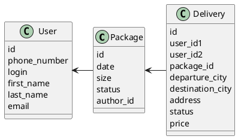

# Компонентная архитектура
<!-- Состав и взаимосвязи компонентов системы между собой и внешними системами с указанием протоколов, ключевые технологии, используемые для реализации компонентов.
Диаграмма контейнеров C4 и текстовое описание. 
-->
## Компонентная диаграмма

```plantuml
@startuml
!include https://raw.githubusercontent.com/plantuml-stdlib/C4-PlantUML/master/C4_Container.puml

AddElementTag("microService", $shape=EightSidedShape(), $bgColor="CornflowerBlue", $fontColor="white", $legendText="microservice")
AddElementTag("storage", $shape=RoundedBoxShape(), $bgColor="lightSkyBlue", $fontColor="white")

Person(admin, "Администратор")
Person(user, "Пользователь")

System(web_site, "Клиентский веб-сайт", "HTML, CSS, JavaScript, React", "Веб-интерфейс")

System_Boundary(conference_site, "Сайт доставки") {
   'Container(web_site, "Клиентский веб-сайт", ")
   Container(client_service, "Сервис авторизации", "C++", "Сервис управления пользователями", $tags = "microService")    
   Container(package_service, "Сервис создания посылок", "C++", "Сервис управления посылками", $tags = "microService") 
   Container(delivery_service, "Сервис создания доставок", "C++", "Сервис управления доставками", $tags = "microService")   
   ContainerDb(db, "База данных", "MySQL", "Хранение данных пользователях, посылках, доставках", $tags = "storage")
   
}

Rel(admin, web_site, "Поиск пользователя, просмотр информации по заказам пользователей")
Rel(user, web_site, "Регистрация, создание заказа, просмотр статуса заказа")

Rel(web_site, client_service, "Работа с пользователями", "localhost/person")
Rel(client_service, db, "INSERT/SELECT/UPDATE", "SQL")

Rel(web_site, package_service, "Работа с посылками", "localhost/pres")
Rel(package_service, db, "INSERT/SELECT/UPDATE", "SQL")

Rel(web_site, delivery_service, "Работа с доставками", "localhost/conf")
Rel(delivery_service, db, "INSERT/SELECT/UPDATE", "SQL")
 
@enduml
```
## Список компонентов  

### Сервис авторизации
**API**:
-	Создание нового пользователя
      - входные параметры: номер телефона, login, пароль, имя, фамилия, email
      - выходные параметры: отсутствуют
-	Поиск пользователя по логину
     - входные параметры: login
     - выходные параметры: номер телефона, имя, фамилия, email
-	Поиск пользователя по маске имени и фамилии
     - входные параметры: маска фамилии, маска имени
     - выходные параметры: номер телефона, login, имя, фамилия, отчество, email

### Сервис создания посылок
**API**:
- Создание посылки
  - Входные параметры: габариты посылки, login пользователя
  - Выходыне параметры: идентификатор посылки, время создания, статус
- Получение посылок пользователя
  - Входные параметры: login пользователя
  - Выходные параметры: массив посылок с их идентификаторами, времени создания, статусом, размером

### Сервис создания доставки
**API**:
- Создание доставки от пользователя к пользователю
  - Входные параметры: город отправки, город назначения, адрес получения, id отправителя, id получателя, идентификатор посылки
  - Выходные параметры: идентификатор доставки, статус доставки, стоимость доставки
- Получение информации о доставке получателю
  - Входные параметры: идентификатор доставки
  - Выходные параметры: массив со статусом доставки, адресом получения, идентификатором посылки, стоимость доставки
- Получение информации о доставке по отправителю
  - Входные параметры: идентификатор доставки
  - Выходные параметры: массив со статусом доставки, адресом получения, идентификатором посылки, стоимость доставки


### Модель данных
